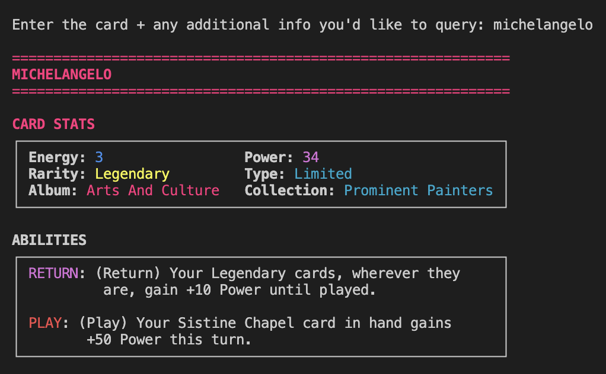

# CUE Cards API

A FastAPI-based tool that fetches and displays CUE (Cards, the Universe and Everything) card data from the official fandom wiki. The tool provides both a CLI interface with colorful card displays and a REST API for programmatic access.

---



---

## Features

- **Interactive CLI**: Query cards with a beautiful, color-coded terminal display
- **REST API**: Programmatic access to card data via HTTP endpoints
- **Rich Card Data**: Fetches comprehensive card information including:
  - Energy and Power stats
  - Rarity levels (Common, Rare, Epic, Legendary, Fusion, Ultra Fusion, Mythic)
  - Card types (Standard, Limited)
  - Albums (Paleontology, History, Oceans & Seas, Life on Land, Space, Arts & Culture, Science)
  - Ability triggers and descriptions
- **Color-coded Display**: Visual representation with rarity-based colors and formatted stats
- **AI-powered Data Extraction**: Uses OpenAI's API to intelligently extract card data from wiki pages

## Installation

1. **Clone the repository**:

   ```bash
   git clone <repository-url>
   cd cue-cards-api
   ```

2. **Create and activate a virtual environment**:

   ```bash
   python -m venv venv
   source venv/bin/activate  # On Windows: venv\Scripts\activate
   ```

3. **Install dependencies**:

   ```bash
   pip install -r requirements.txt
   ```

4. **Set up your OpenAI API key**:

   ```bash
   export OPENAI_API_KEY=your_openai_api_key_here
   ```

   Or add it to your shell configuration file (e.g., `~/.zshrc`, `~/.bashrc`):

   ```bash
   echo 'export OPENAI_API_KEY=your_openai_api_key_here' >> ~/.zshrc
   source ~/.zshrc
   ```

## Usage

### CLI Mode (Interactive)

Run the tool in interactive mode to query cards with a beautiful terminal display:

```bash
python main.py
```

This will:

- Start a FastAPI server in the background
- Provide an interactive prompt for card queries
- Display cards with color-coded formatting based on rarity, album, and stats

**Example interaction**:

```
Enter the card you'd like to query: Albert Einstein
```

The tool will fetch the card data and display it with:

- Color-coded headers based on the card's album
- Formatted stats table with Energy and Power
- Rarity and type information with appropriate colors
- Ability triggers and descriptions with proper formatting

### API Mode

Start the server for programmatic access:

```bash
uvicorn main:app --reload
```

The API will be available at `http://localhost:8000` with the following endpoints:

#### Endpoints

- **GET `/`**: Health check endpoint
- **POST `/card`**: Query card data
  - Body: `"card_name"` (string)
  - Returns: Complete card data as JSON
- **GET `/health`**: Service health status
- **GET `/docs`**: Interactive API documentation (Swagger UI)

#### Example API Usage

```bash
curl -X POST "http://localhost:8000/card" \
  -H "Content-Type: application/json" \
  -d '"Albert Einstein"'
```

### Card Data Structure

The API returns card data in the following format:

```json
{
  "name": "Albert Einstein",
  "energy": 5,
  "power": 8,
  "rarity": "legendary",
  "type": "standard",
  "album": "science",
  "collection": "Scientists",
  "ability_triggers": ["play", "return"],
  "ability_descriptions": [
    "Draw 2 cards when played",
    "Gain 3 energy when returned to hand"
  ]
}
```

## Color Coding

The CLI interface uses an extensive color scheme to enhance readability:

### Rarity Colors

- **Common**: Grey
- **Rare**: Brown
- **Epic**: Silver
- **Legendary**: Gold
- **Fusion**: Red
- **Ultra Fusion**: Bright Orange
- **Mythic**: Violet

### Album Colors

- **Paleontology**: Dark Orange
- **History**: Yellow
- **Oceans & Seas**: Blue
- **Life on Land**: Green
- **Space**: Purple
- **Arts & Culture**: Pink
- **Science**: Turquoise

### Stat Colors

- **Energy**: Light Blue
- **Power**: Purple
- **Triggers**: Color-coded by type (Draw: Lime, Play: Light Red, Return: Purple, Start: Yellow)

## Dependencies

- **FastAPI**: Web framework for the API
- **OpenAI**: AI-powered data extraction from wiki pages
- **Pydantic**: Data validation and serialization
- **Uvicorn**: ASGI server for running the API

## Data Source

Card data is extracted from the [CUE Cards Fandom Wiki](https://cards-the-universe-and-everything.fandom.com/) using OpenAI's search-enabled model to intelligently parse and structure the information.

## Error Handling

The tool includes comprehensive error handling for:

- Missing OpenAI API key
- Invalid card names
- Network connectivity issues
- API rate limiting
- Malformed responses

## Development

To run in development mode with auto-reload:

```bash
uvicorn main:app --reload --host 0.0.0.0 --port 8000
```

## Contributing

1. Fork the repository
2. Create a feature branch
3. Make your changes
4. Test thoroughly
5. Submit a pull request

## License

[Add your license information here]
